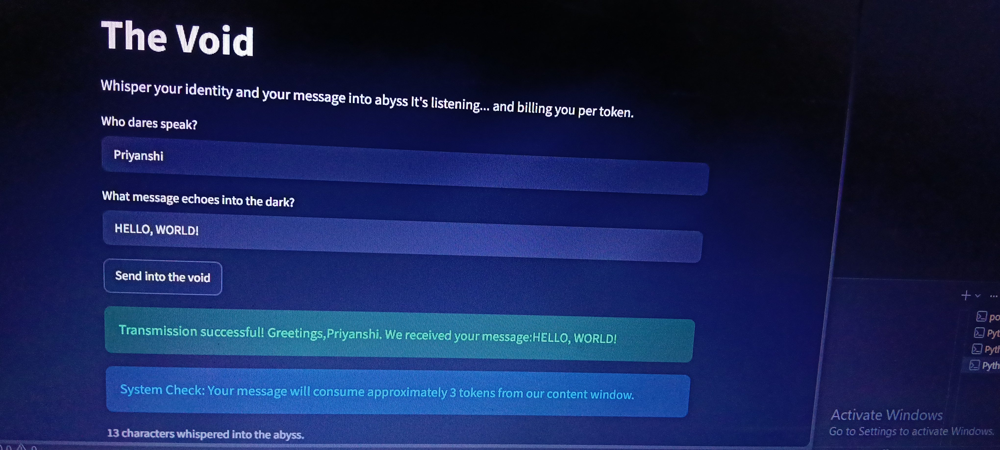

ASSIGNMENT 1
# 🕳️ The Void — A Streamlit Echo Interface

A small interactive web app built with **Streamlit** that collects a user's name and message, validates the input, and echoes back a personalized response — along with an estimated **token cost**, similar to how real AI APIs bill for usage.

Built as part of my self-directed learning path toward becoming a **GenAI / RAG Engineer**.

## 🚀 What it does

- Takes a name and a message from the user
- Validates that both fields are filled before processing (handles empty-input edge cases)
- Displays a personalized success message once submitted
- Estimates the **token cost** of the message using the common heuristic: `1 token ≈ 4 characters`

## 🧠 What I learned

- How Streamlit abstracts away HTML/CSS/JS to build interactive UIs purely in Python
- Handling UI state and conditional logic (`if / elif / else`) for form validation
- The token-based billing concept behind LLM APIs, and how to estimate cost from raw text

## 🛠️ Tech Stack

- Python
- [Streamlit](https://streamlit.io)

## ▶️ Run it locally

```bash
pip install streamlit
streamlit run identity_echo_interface.py
```

Then open the local URL shown in your terminal (usually `http://localhost:8501`).

## 📌 About this project

This is part of a broader summer learning roadmap covering Python, DSA, and Retrieval-Augmented Generation (RAG) fundamentals, aimed at building real, deployable GenAI applications.

## 📸 Screenshot



